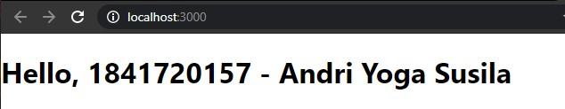
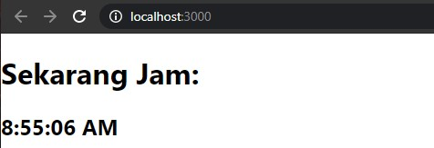
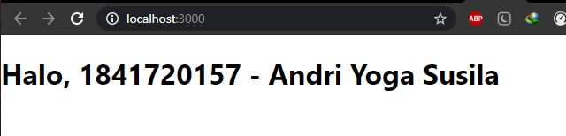
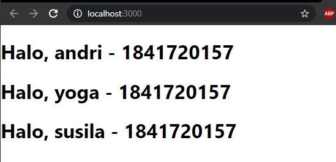
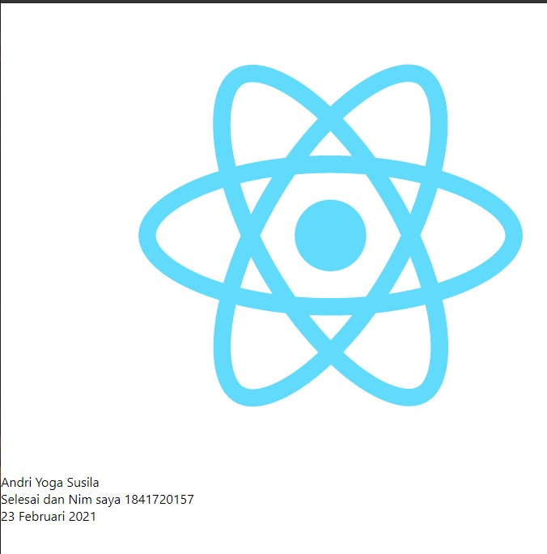
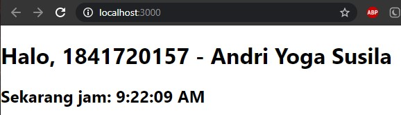
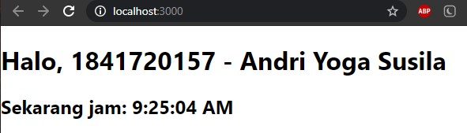

# 03 - Layout

## Tujuan Pembelajaran

1. Mahasiswa dapat memahami konsep modern javascript
2. Mahasiswa dapat membuat variable dan parameter lain di javascript

## Hasil Praktikum

##Praktikum 1

Hasil NPX CREATE REACT

[contoh link ini](../../../src/03_konsep_reactjs/praktikum1/index.js)

##Praktikum 2

Hasil NPX CREATE REACT

[contoh link ini](../../../src/03_konsep_reactjs/praktikum2/index.js)

##Praktikum 3

Hasil NPX CREATE REACT

[contoh link ini](../../../src/03_konsep_reactjs/praktikum3/index.js)

##Praktikum 4

Hasil NPX CREATE REACT

[contoh link ini](../../../src/03_konsep_reactjs/praktikum4/App.js)

[contoh link ini](../../../src/03_konsep_reactjs/praktikum4/index.js)

##Praktikum 5

Hasil NPX CREATE REACT

[contoh link ini](../../../src/03_konsep_reactjs/praktikum5/App.js)

##Praktikum 6

Hasil NPX CREATE REACT

[contoh link ini](../../../src/03_konsep_reactjs/praktikum6/index.js)