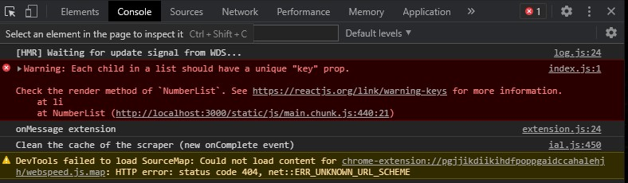

# 04 - konsep_reactjs_part2

## Tujuan Pembelajaran

1. Mahasiswa dapat memahami konsep modern javascript
2. Mahasiswa dapat membuat variable dan parameter lain di javascript

## Hasil Praktikum

##Praktikum 1

[contoh link ini](../../src/04_konsep_reactjs_part2/praktikum1/index.js)

[contoh link ini](../../src/04_konsep_reactjs_part2/praktikum1/index-cara2.js)

[contoh link ini](../../src/04_konsep_reactjs_part2/praktikum1/index-cara3.js)

##Praktikum 2

[contoh link ini](../../src/04_konsep_reactjs_part2/praktikum2/index.js)

##Praktikum 3

[contoh link ini](../../src/04_konsep_reactjs_part2/praktikum3/index.js)

##Praktikum 4

[contoh link ini](../../src/04_konsep_reactjs_part2/praktikum4/index.js)

##Praktikum 5

[contoh link ini](../../src/04_konsep_reactjs_part2/praktikum5/index.js)

##Praktikum 6

[contoh link ini](../../src/04_konsep_reactjs_part2/praktikum6/index.js)

[contoh link ini](../../src/04_konsep_reactjs_part2/praktikum6/indexke2.js)

[contoh link ini](../../src/04_konsep_reactjs_part2/praktikum6/indexke3.js)

[contoh link ini](../../src/04_konsep_reactjs_part2/praktikum6/indexke4.js)