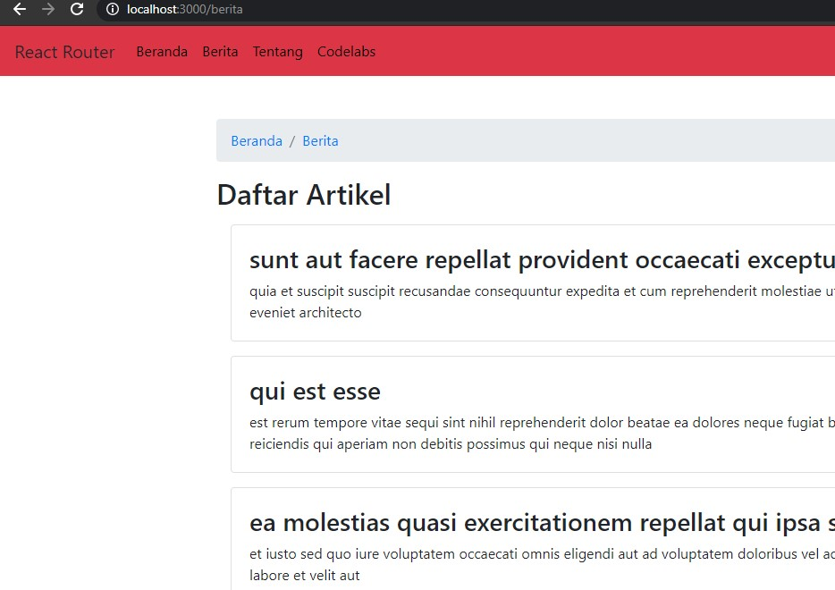

# 05 - API dan Router di ReactJs

## Tujuan Pembelajaran

1. Mahasiswa dapat memahami konsep modern javascript
2. Mahasiswa dapat membuat variable dan parameter lain di javascript

## Hasil Praktikum

##Praktikum 1

s

[contoh link ini](../../src/05_API_dan_Router_di_ReactJs/praktikum1/index.js)

##Praktikum 2

[contoh link ini](../../src/05_API_dan_Router_di_ReactJs/praktikum2/index.js)

##Praktikum 3

[contoh link ini](../../src/05_API_dan_Router_di_ReactJs/praktikum3/App.js)

##Tugas

[contoh link ini](../../src/05_API_dan_Router_di_ReactJs/tugas/src/App.js)

