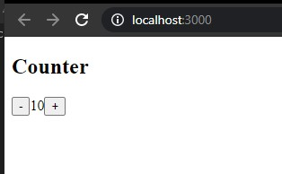
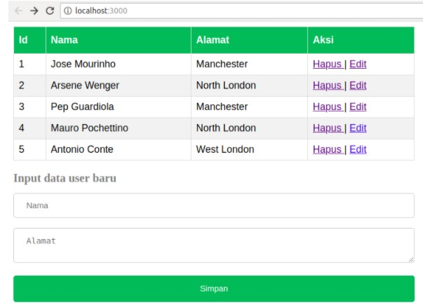
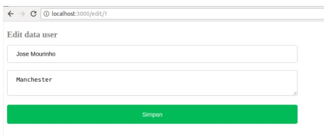

# 06 - Redux di ReactJS

## Tujuan Pembelajaran

1. Konsep Redux dan manfaatnya
2. Instalasi dan konfigurasi Redux di ReactJS
3. Membuat aplikasi sederhana dengan Redux di ReactJS

## Hasil Praktikum

##Praktikum 1

[contoh link ini](../../src/06_redux/App.js)

[contoh link ini](../../src/06_redux/index.js)

##Tugas
1. Fungsinya untuk memanggil dan mengirimkan ke store dan mentrigger agar state berubah sesuai dengan yang diclick

2. 
    a. Action = merupakan objek JavaScript ("{ }") yang memberitahu reducer untuk memodifikasi data. Syaratnya, action harus memiliki properti type berupa String.

    b. Reducers = sebuah fungsi yang memiliki kembalian data (return some data).

    c. Action Creators = fungsi yang mengembalikan suatu tindakan atau aksi.

    d. Middleware = Suatu point yang menjadi titik tengah saat mengirim aksi dan saat meraih reducers.

    e. Pure Function = Sebuah function yang jika diberi argumen yang sama maka akan menghasilkan output yang sama

    f. Immutability = Suatu objek yang tidak bisa dimodifikasi kembali setelah dibuat

3. (MapStateToProps)(Counter) yaitu menerima counter store sebagai argumen. Ini mengembalikan objek yang menggambarkan bagaimana keadaan store dipetakan ke dalam properti.

4. sumber : https://github.com/ridoansaleh/belajar-react-redux

[contoh link ini](../../src/06_redux/index2.js)

[contoh link ini](../../src/06_redux/AppContainer.js)

[contoh link ini](../../src/06_redux/user-action.js)

