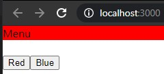

# 07 - Context dan HOC

## Tujuan Pembelajaran

1. Konsep Context dan manfaatnya
2. Konsep HOC di ReactJS

## Hasil Praktikum

##Praktikum 1

[App](../../src/07_Context_dan_HOC/App.js)

[index](../../src/07_Context_dan_HOC/index.js)

[Menu](../../src/07_Context_dan_HOC/Menu.js)

[SetColor](../../src/07_Context_dan_HOC/SetColor.js)

[theme-context](../../src/07_Context_dan_HOC/ThemeContext/theme-context.js)

[themeProvider](../../src/07_Context_dan_HOC/ThemeContext/themeProvider.js)

[withtheme](../../src/07_Context_dan_HOC/ThemeContext/withtheme.js)

