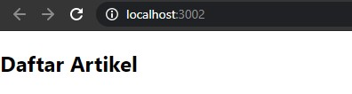
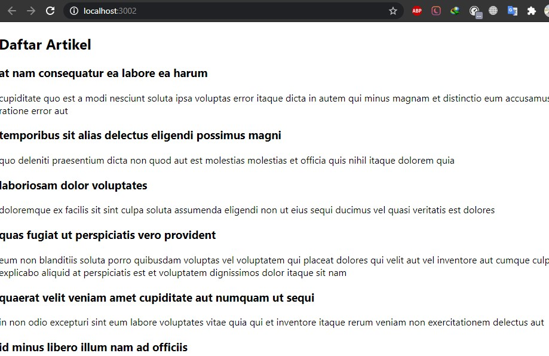
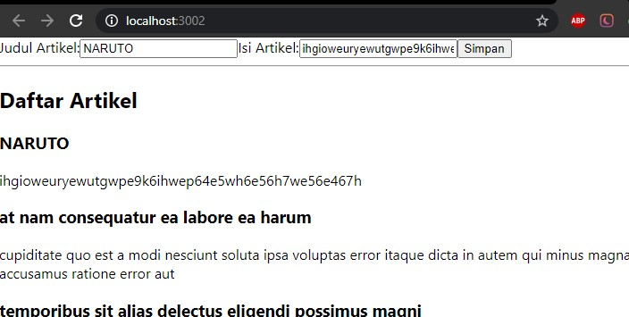
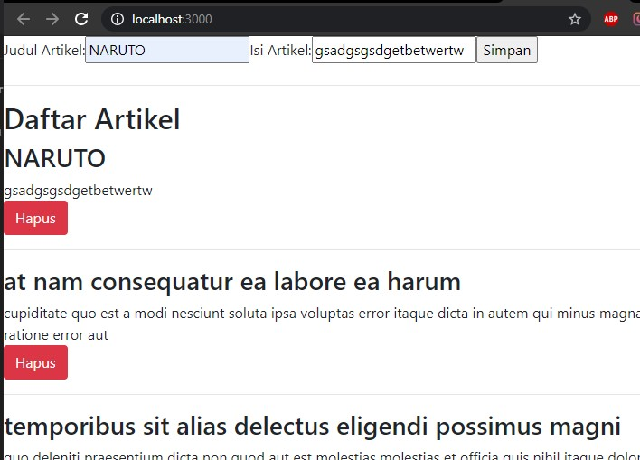
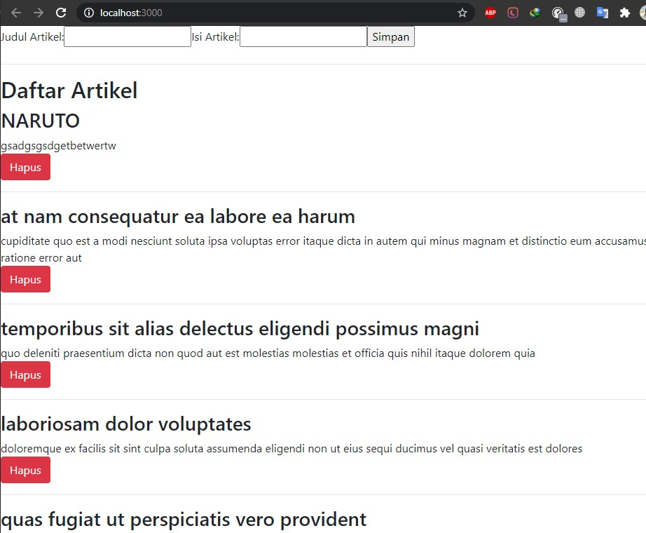
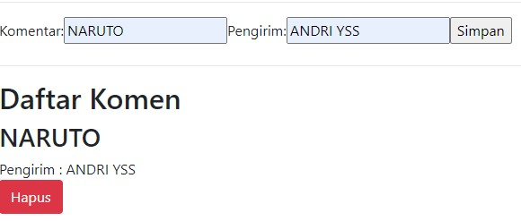
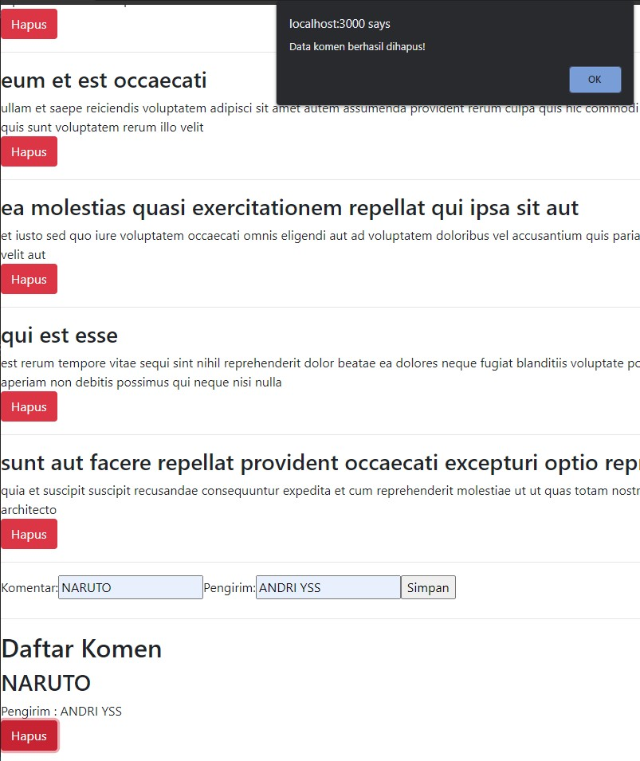
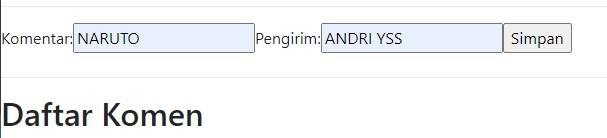

# 09 - Global_API_dan_Hooks

## Tujuan Pembelajaran

1. memahami Konsep dan implementasi Global API
2. memahami Konsep dan implementasi Hooks

## Hasil Praktikum 

## Membuat Global API Service GET

## Membuat Restful API Lokal

## Membuat Global API Service POST

## Membuat Global API Service DELETE

## Mengelola Global API Service

## Tugas
### Menambahkan Komentar

### menampilkan dan menghapus komentar, artikel

### hasil setelah di hapus

File Project :
[Source Codee](../../src/09_Global_API_dan_Hooks/File)
