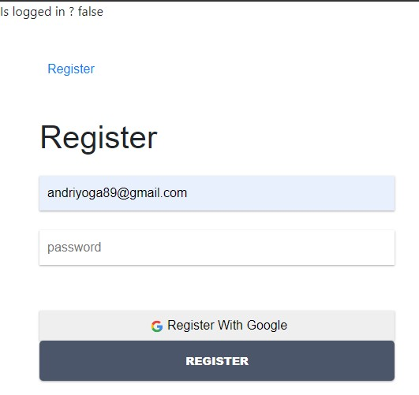
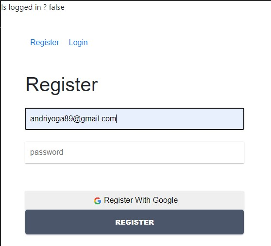
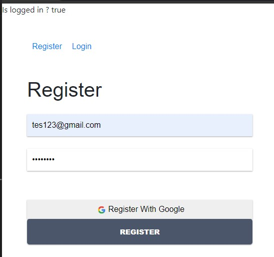
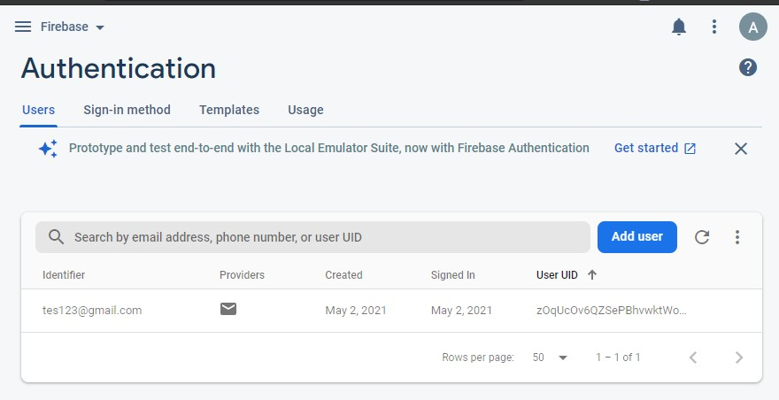
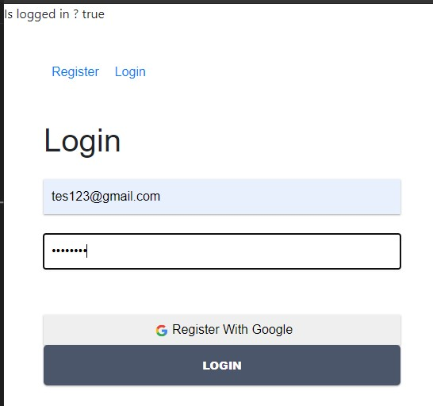
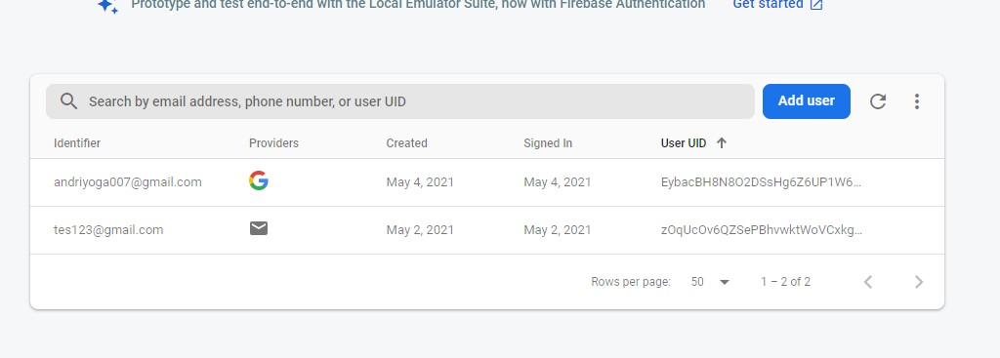
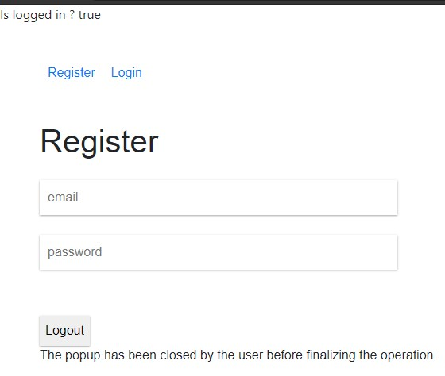
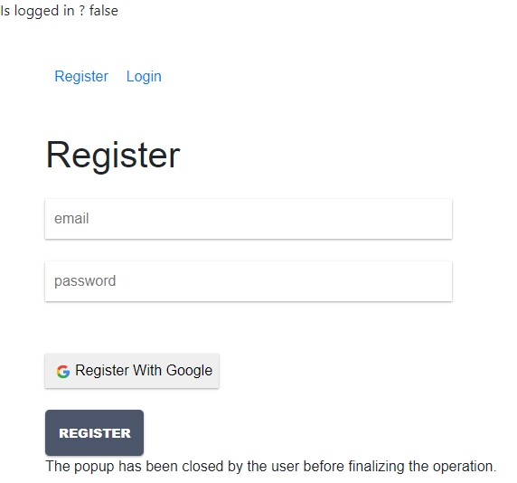
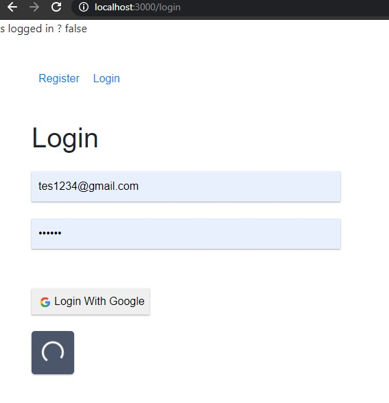

# 10 - Firebase di ReactJS

## Tujuan Pembelajaran

1. memahami Konsep dan implementasi Firebase di ReactJSs

## Hasil Praktikum :

### Praktikum 1: Membuat Form Register

## Praktikum 2: Membuat Form Login

## Praktikum 3: Membuat Koneksi ke Firebase

## Membuat Koneksi Firebase di Form Register

## Membuat Koneksi Firebase di Form Login

# Tugas
1. Dari praktikum sebelumnya, tambahkan aksi pada tombol "Login with Google" dan "Logout" agar bisa melakukan login dan logout dengan akun Google yang sudah kita miliki.
### Login Dengan Google

### Setelah selesai Login dengan google

### Setelah Logout 

2. Tambahkan animasi loading saat melakukan registrasi dan login. Boleh menggunakan dari tema boostrap atau lainnya.

### Setelah Logout 

File Project : [Source Codee](../../src/10_Firebase_di_ReactJS/src)
