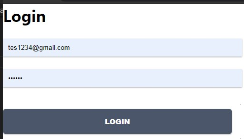
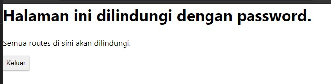

# 11 - Redux Thunk

## Tujuan Pembelajaran

1. memahami KoKonsep dan implementasi Redux-Thunk di ReactJS
2. memahami Konsep dan implementasi Firebase Login dengan Redux-Thunk di ReactJS

## Hasil Praktikum :

### Praktikum 1

# Tugas
1. Berdasarkan praktikum yang telah Anda lakukan, jelaskan perbedaan fitur yang ada dalam komponen Login dan Home! Mengapa komponen Login tidak menggunakan class seperti pada komponen Home ?

Jawab : 

2. Jelaskan kegunaan dan alur logika dari protectedRoute.js !

Jawab : 

3. Coba lakukan login dengan email atau password yang salah, apa yang terjadi? Jelaskan!

Jawab : 

4. Jika Anda berada di halaman Home, coba akses form login tanpa melakukan logout. Apakah form login bisa diakses? Jelaskan!

Jawab : 

5. Tambahkan menu Register pada form login sehingga user yang belum terdaftar dapat melakukan registrasi! Jika registrasi sukses, maka user langsung diarahkan ke halaman Home

Jawab : 

File Project : [Source Codee](../../src/11_Redux_Thunk/src)
