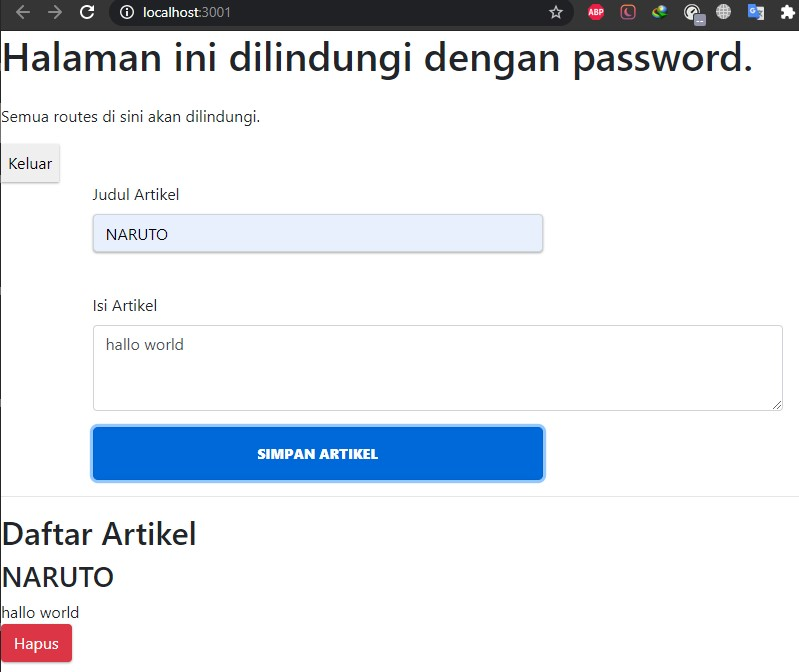
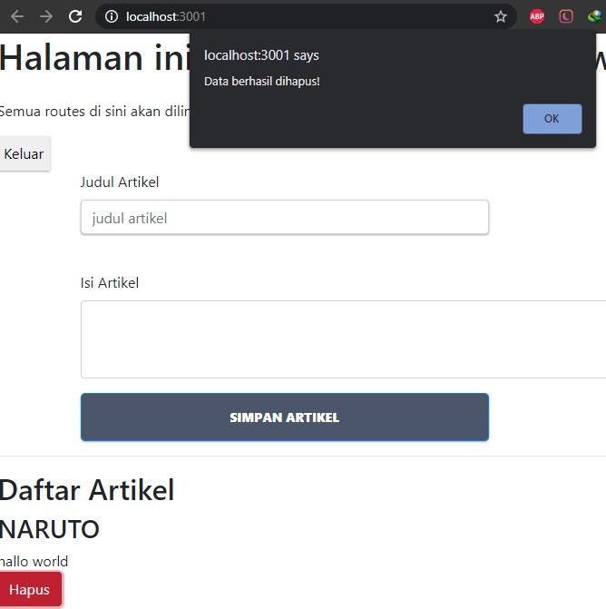
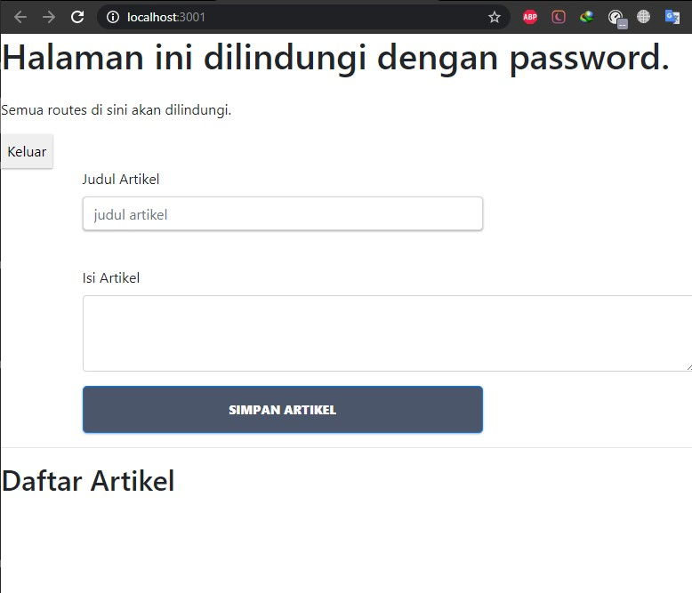

# 11 - CRUD Firebase

## Tujuan Pembelajaran

1. memahami Konsep dan implementasi CRUD dengan Firebase di ReactJS

## Hasil Praktikum :

### Praktikum 2

### Praktikum 3

### Praktikum 4

# Tugas

File Project : [Source Codee](../../src/12_CRUD_Firebase/src)