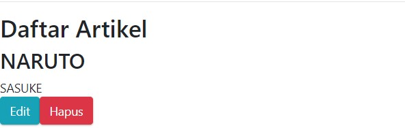

# 11 - CRUD Firebase

## Tujuan Pembelajaran

1. memahami Konsep dan implementasi CRUD dengan Firebase di ReactJS

## Hasil Praktikum :

### Praktikum 2

### Praktikum 3

### Praktikum 4
Daftar Artikel

# Tugas

1. Berdasarkan praktikum 1 yang telah Anda lakukan, jelaskan perbedaan fungsi locked mode dan test mode pada langkah 3 saat Anda konfigurasi database Firebase?

Jawab : Perbedaan dari fungsi locked mode dan test mode adalah pada penulisan dan pembacaan data. Ketika masuk locked mode, maka data tidak akan bisa diakses maupun diolah karena pada pengaturannya diatur false dan sebaliknya pada test mode, data bisa diakses dan diolah

2. Buatlah variabel userId pada praktikum 2 langkah 4 agar dapat menyimpan email dari user yang sedang login, sehingga dapat tersimpan di database!

Jawab : Isi pada userId diubah menjadi firebase.auth().currentUser.email

3. Jelaskan maksud kode ini (dataArtikel || []) pada praktikum 2 langkah 6! Mengapa berbeda dari codelabs sebelumnya untuk menampilkan daftar artikel?

Jawab : Perintah tersebut berfungsi untuk menampilkan map data dalam bentuk array maupun object. Pada codelabs sebelumnya tidak seperti itu karena data yang diambil hanya berbentuk object.

4. Lengkapilah kode pada praktikum 4 langkah 5 agar dapat melakukan update artikel! Mengapa setelah klik tombol Update Artikel, form Modal tidak hilang? Bagaimana Anda mengatasi hal tersebut?

Jawab : Karena showEdit tidak diubah menjadi false lagi, sehingga modal tidak menghilang

5. Ketika Anda menekan tombol Edit, lalu menekan tombol Batal pada form Modal update artikel. Kemudian coba tambah artikel baru, maka artikel yang tadi kita klik tombol Edit akan berubah jadi data yang artikel baru ditambahkan. Mengapa demikian? Silakan diperbaiki.

Jawab : Karena pada onSubmit form modal memanggil fungsi handleTombolSimpan, sehingga data baru yang akan tersimpan.

File Project : [Source Codee](../../src/12_CRUD_Firebase/src)