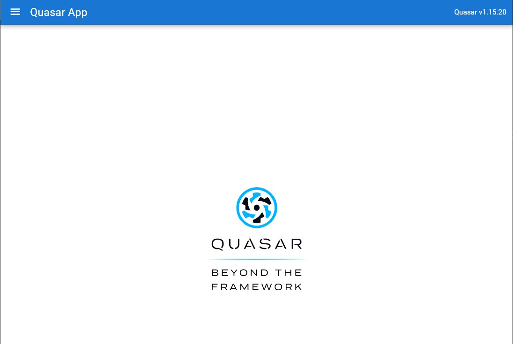
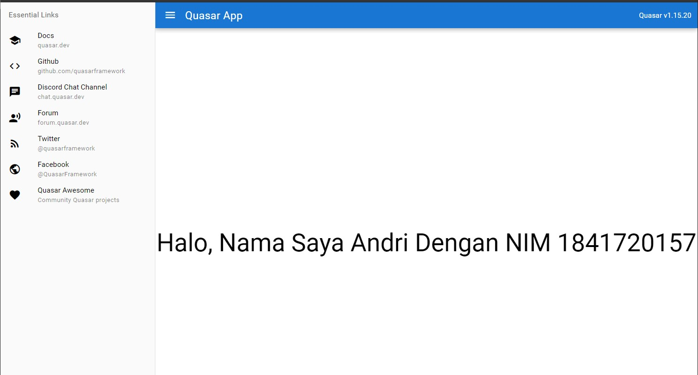

# 12 - Pengenalan Quasar Framework
 
## Tujuan Pembelajaran

1. memahami tentang Pengenalan dan instalasi Quasar Framework
2. memahami tentang Sekilas tentang Vue.js
3. memahami tentang Hasil survei Quasar 2020

## Hasil Praktikum :

### Praktikum 1

### Praktikum 2

# Tugas

1. Berdasarkan praktikum 1 yang telah Anda lakukan, jelaskan kegunaan file quasar.conf.js ?

Jawaban : 

Mengekspor fungsi yang mengambil parameter (konteks) dan mengambil Object.

2. Jelaskan maksud istilah SPA, SSR, PWA, BEX, Electron app, Cordova, dan Linting code! 

Jawaban : 
- SPA : Untuk menggunakan pengambilan klien PWA(yang merupakan kombo pembunuh), mode PWA Quasar CLI akan diinstal juga.
- PWA : Untuk memuat font saat membangun untuk mode tertentu dan memilih yang lain.
- BEX : -
- Electron app : Untuk mengembangkan dan membangun Aplikasi Elektron.
- Cordava : Untuk menghindari memuat file tersebut untuk mode lainnya.
- Linting code : -

3. Jelaskan maksud dan perbedaan ES6, ECMAScript 6, dan ECMAScript 2015 !
Jawab : 

File Project : [Source Codee](../../src/13_Pengenalan_Quasar_Framework/src)